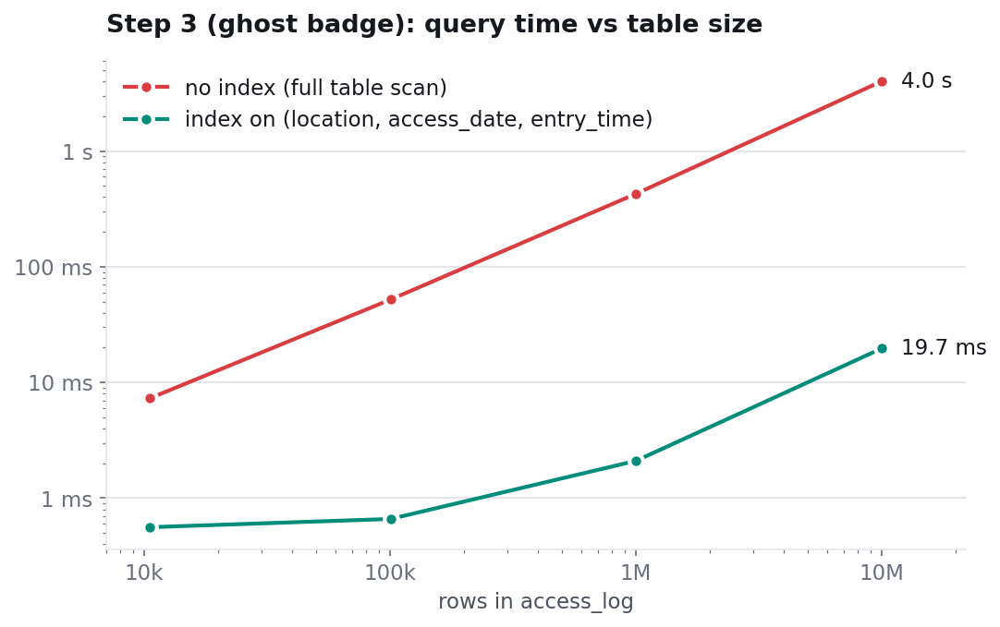
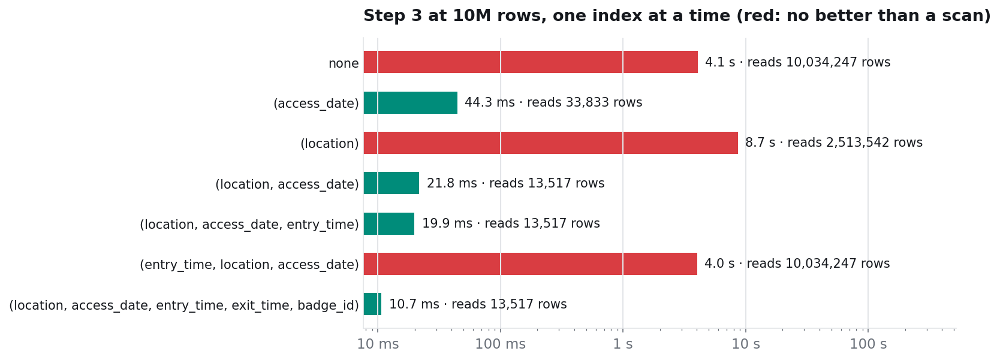

# 1. Indexes: from a year of swipes to one room on one night

Experiments: `benchmark/04_scaling.py`, `benchmark/06_index_design.py`, `benchmark/09_storage.py`.
Plans: `results/plans/ghost_no_index.txt`, `results/plans/ghost_with_index.txt`.

## The query

Step 3 of the lab, the swipe into Room 204 on the murder night whose badge belongs to nobody:

```sql
SELECT a.*
FROM access_log a
LEFT JOIN badges b ON b.badge_id = a.badge_id
WHERE b.badge_id IS NULL
  AND a.location = 'Room 204'
  AND a.access_date = '2026-09-21';
```

In the lab's schema `access_log` only has its primary key, so MySQL has no way to find "Room 204 on 21/09" without looking at every row.

## Scaling: linear without an index, flat with one



| rows | no index | with index | speed-up |
|---:|---:|---:|---:|
| 10,513 | 7.3 ms | 0.56 ms | 13× |
| 100,756 | 52.1 ms | 0.66 ms | 79× |
| 1,003,186 | 427 ms | 2.1 ms | 203× |
| 10,027,486 | 4,014 ms | 19.7 ms | 204× |

Index: `CREATE INDEX idx_loc_date_time ON access_log (location, access_date, entry_time)`, built once in 41.7 s at 10M rows.

Without the index the time grows with the table: ten times the rows, ten times the time. With it, the time grows only with the number of swipes in Room 204 **on that day** (6,758 at 10M rows, because the synthetic campus has about 26,000 swipes a day). At 10k rows that day has almost nothing, so the query is basically free.

The same holds for the course version of step 10 (`EXCEPT`): 7,598 ms without the index, 39.8 ms with it.

## What the plan says

Without the index (abridged):

```
-> Nested loop antijoin                           (actual time=0.43..4686 rows=1)
    -> Filter: access_date = '2026-09-21' and location = 'Room 204'   (rows=6758)
        -> Table scan on a                        (actual time=0.28..4060 rows=10e+6)
    -> Single-row covering index lookup on b using PRIMARY            (loops=6758)
```

With the index:

```
-> Nested loop antijoin                           (actual time=22.9..22.9 rows=1)
    -> Index lookup on a using idx_loc_date_time
       (location='Room 204', access_date=DATE'2026-09-21')             (rows=6758)
    -> Single-row covering index lookup on b using PRIMARY            (loops=6758)
```

The work after the first step is identical: 6,758 lookups in `badges`. The only difference is how MySQL finds those 6,758 rows: by reading 10 million, or by jumping straight to them.

## Which index? Seven variants, one at a time

`06_index_design.py` drops every secondary index, then builds one variant at a time on the 10M table and runs step 3 and the first block of step 10 ("who was inside the building for the whole window").



| index | build | size | step 3 | rows read | step 10, first block |
|---|---:|---:|---:|---:|---:|
| none | | | 4,060 ms | 10,034,247 | 3,764 ms |
| `(access_date)` | 19.0 s | 139 MB | 44.3 ms | 33,833 | 33.6 ms |
| `(location)` | 32.0 s | 202 MB | **8,651 ms** | 2,513,542 | 8,533 ms |
| `(location, access_date)` | 41.4 s | 235 MB | 21.8 ms | 13,517 | 11.5 ms |
| `(location, access_date, entry_time)` | 42.7 s | 268 MB | 19.9 ms | 13,517 | 14.5 ms |
| `(entry_time, location, access_date)` | 35.0 s | 268 MB | 4,023 ms | 10,034,247 | 3,690 ms |
| `(location, access_date, entry_time, exit_time, badge_id)` | 50.0 s | 424 MB | **10.7 ms** | 13,517 | **5.1 ms** |

What this shows:

- **An index on a column with few values can be worse than no index.** `location` has 4 values, so "Room 204" matches a quarter of the table. MySQL uses the index anyway and does 2.5 million random lookups into the table: twice as slow as reading it all in order.
- **Selectivity matters more than the "right" column.** `(access_date)` alone narrows 10M rows to one day (about 26,000) and already gives a 90× speed-up.
- **Equality columns first, range column last.** With `entry_time` first, the index is sorted by time of day and neither the room nor the date can be used to narrow it: the optimizer ignores it and scans the table.
- **The third column did not help here.** `entry_time <= '19:37:00'` keeps most of the day's swipes, so `(location, access_date)` and `(location, access_date, entry_time)` read the same rows. It would pay off for a narrow time range.
- **A covering index is the fastest and the biggest.** With every column the query needs inside the index, MySQL never touches the table: 10.7 ms and 5.1 ms, for 424 MB of index (two thirds of the table's size).

## Space

| rows | table | index `(location, access_date, entry_time)` |
|---:|---:|---:|
| 10,513 | 1.5 MB | 0.3 MB |
| 100,756 | 5.5 MB | 3.5 MB |
| 1,003,186 | 53.6 MB | 27.6 MB |
| 10,027,486 | 628 MB | 268 MB |

The index costs about 43% of the table's size and has to be updated on every insert (see [schema design](05-schema-design.md) for the insert side).
