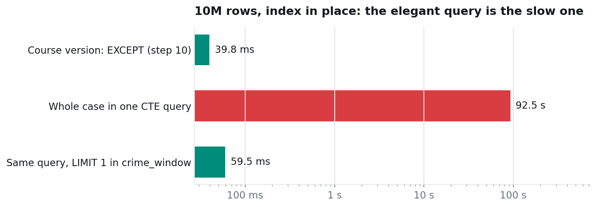

# 2. The elegant query was the slowest one

Experiment: `benchmark/04_scaling.py` (queries `case` and `case_fixed`).
Queries: `benchmark/case_all_in_one_slow.sql`, `benchmark/case_all_in_one_fixed.sql`.
Plans: `results/plans/case_slow.txt`, `results/plans/case_fixed.txt`.

## The idea

Step 11 of the lab stores the answer by typing it in. The advanced version (`solutions/02_steps_advanced.sql`) lets the database find it instead, in one statement built from named steps:

```sql
WITH crime_window AS (      -- 19:37 and 19:48, read from the ghost badge swipe
  SELECT a.access_date AS d, a.entry_time AS t_in, a.exit_time AS t_out
  FROM access_log a
  WHERE a.location = 'Room 204' AND a.access_date = '2026-09-21'
    AND NOT EXISTS (SELECT 1 FROM badges b WHERE b.badge_id = a.badge_id)
),
inside AS (...),            -- in the building for the whole window
alibi AS (...),             -- in a lecture, the Library or the Gym (UNION)
jealous_exes AS (...)       -- ex-partners of the victim's girlfriend
SELECT s.first_name, s.last_name,
       CONCAT('Love jealousy: ', j.her_name, ' left him for Maximilian'),
       w.t_in
FROM inside i
JOIN students s     ON s.student_id = i.student_id
JOIN jealous_exes j ON j.student_id = i.student_id
CROSS JOIN crime_window w
WHERE i.student_id NOT IN (SELECT student_id FROM alibi);
```

No hard-coded time appears anywhere. On the lab's 486 rows it answers in a few milliseconds.

## The measurement



| rows | one-query version, no index | one-query version, with index | same query + `LIMIT 1`, with index | course `EXCEPT` (step 10), with index |
|---:|---:|---:|---:|---:|
| 10,513 | 26.0 ms | 3.3 ms | 1.4 ms | 0.7 ms |
| 100,756 | 228 ms | 15.3 ms | 2.2 ms | 1.0 ms |
| 1,003,186 | 2,205 ms | 1,790 ms | 7.3 ms | 4.0 ms |
| 10,027,486 | 22,158 ms | **92,455 ms** | **59.5 ms** | 39.8 ms |

(At 10M rows the two runs of the one-query version take over 20 s each and were timed once; everything else is a median.)

At 10M rows the index makes the query **four times slower**, and the plain three-step `EXCEPT` from the lab is the fastest of all.

## Why: the plan

The optimizer does not compute `crime_window` once. It **merges** the CTE into every place that uses it, and in the `alibi` branch that means: for every Library or Gym swipe of the day, go back to Room 204 and find the ghost badge again.

From `results/plans/case_slow.txt`:

```
-> Index range scan on a using idx_loc_date_time
   over (location = 'Gym' AND ...) OR (location = 'Library' AND ...)      (rows=13511)
...
-> Index lookup on a using idx_loc_date_time
   (location='Room 204', access_date=DATE'2026-09-21')
   with index condition: (a.entry_time <= a.entry_time)                   (rows=3357 loops=13511)
```

13,511 Library and Gym swipes, each followed by a lookup that reads about 3,357 Room 204 rows: about **45 million index reads** to recompute a two-value window. The index made each of those lookups possible, which is why it made the query slower instead of faster.

## The fix: one `LIMIT 1`

```sql
WITH crime_window AS (
  SELECT ...
  WHERE ... AND NOT EXISTS (SELECT 1 FROM badges b WHERE b.badge_id = a.badge_id)
  LIMIT 1
), ...
```

MySQL cannot merge a derived table that has a `LIMIT`, so it **materializes** it: the window is computed once, becomes a one-row table, and its two times are treated as constants. The plan now starts with an ordinary range scan:

```
-> Index range scan on a using idx_loc_date_time
   over (location = 'Main Entrance' AND access_date = '2026-09-21' AND entry_time <= '19:37:00')
```

92,455 ms become 59.5 ms: **1,554× faster**, same answer. `LIMIT 1` is safe here because there is exactly one ghost swipe that night. The query does not check that, so in a real system the assumption should be verified, or the window computed in a separate statement first.

## Takeaways

- A CTE is a way to **write** a query, not an instruction about how to **run** it. The optimizer may merge it into the outer query or materialize it.
- The same query can be fast on a small table and pathological on a large one; the lab's 486 rows would never show this.
- Read the plan: `loops=13511` on a lookup is the whole story in one number.
- Other ways to force materialization in MySQL 8: the `NO_MERGE` hint on the right query block, or storing the window in variables first. PostgreSQL has `WITH ... AS MATERIALIZED` for exactly this.
