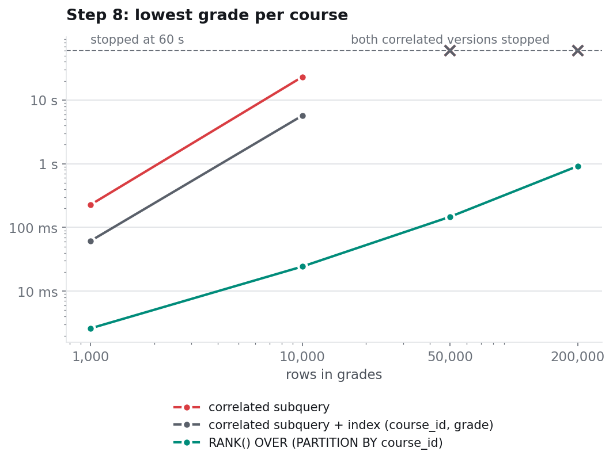

# 3. Correlated subquery vs window function

Experiment: `benchmark/05_correlated_vs_window.py`.
Plan: `results/plans/correlated_10k_with_index.txt`.

## The two queries

Step 8 of the lab: for each course, the student(s) with the lowest grade.

Course version, a **correlated subquery** (the inner query uses the outer row's course):

```sql
SELECT DISTINCT s.student_id
FROM grades g
JOIN students s ON s.student_id = g.student_id
WHERE g.grade = (SELECT MIN(g2.grade)
                 FROM grades g2
                 WHERE g2.course_id = g.course_id);
```

Advanced version, a **window function**:

```sql
SELECT DISTINCT student_id
FROM (
  SELECT s.student_id,
         RANK() OVER (PARTITION BY g.course_id ORDER BY g.grade) AS pos
  FROM grades g
  JOIN students s ON s.student_id = g.student_id
) t
WHERE pos = 1;
```

Both return the same students at every size (the script asserts it). The lab has 64 grades; the experiment uses synthetic tables of 1,000 to 200,000 grades over 4 courses, with a 60-second limit per query.

## The measurement



| grades | correlated subquery | + index `(course_id, grade)` | `RANK() OVER (PARTITION BY course_id)` |
|---:|---:|---:|---:|
| 1,000 | 227 ms | 61.4 ms | 2.6 ms |
| 10,000 | 23.1 s | 5.7 s | 24.3 ms |
| 50,000 | stopped at 60 s | stopped at 60 s | 147 ms |
| 200,000 | stopped at 60 s | stopped at 60 s | 918 ms |

From 1,000 to 10,000 grades (10× the rows) the correlated version gets **about 100× slower**: the signature of a quadratic algorithm. The window function grows roughly in proportion to the rows.

## Why: the plan

From `results/plans/correlated_10k_with_index.txt`, with the best possible index in place:

```
-> Filter: (g.grade = (select #2))                         (rows=775)
    -> Table scan on g                                      (rows=10000)
    -> Select #2 (subquery in condition; dependent)
        -> Aggregate: min(g2.grade)                          (loops=10000)
            -> Covering index lookup on g2 using idx_course_grade
               (course_id=g.course_id)                       (rows=2500 loops=10000)
```

"Dependent" means the subquery is executed **once per outer row**: 10,000 times. Each run reads the whole course, about 2,500 index entries, to compute a minimum it already computed for the previous row of the same course. That is 25 million index reads to produce 4 distinct values.

The index helps each run (reading 2,500 index entries is cheaper than scanning the table) but does not change the shape: still one run per row. MySQL 8.0 does not rewrite this subquery into a grouped join on its own.

The window function sorts each course once and assigns ranks in a single pass.

## Takeaways

- A correlated subquery is correct and readable, and fine on the lab's 64 rows.
- Its cost is (outer rows) × (cost of one inner run). If the inner run touches a whole group, the total is quadratic.
- `RANK()`/`ROW_NUMBER()` with `PARTITION BY` answer "best/worst per group" questions in one pass. An equivalent without window functions is a join against a grouped subquery (`SELECT course_id, MIN(grade) ... GROUP BY course_id`), which is also computed once.
