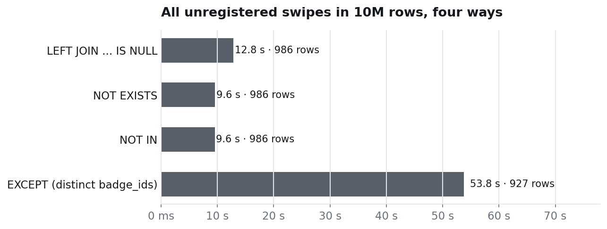

# 4. Four ways to find what is missing

Experiment: `benchmark/07_anti_joins.py`.

Step 3 of the lab is an **anti-join**: keep the swipes that have *no* matching badge. SQL offers several ways to write it, and the lab slides mention three of them (`NOT IN`, `NOT EXISTS`, `EXCEPT`). This experiment runs all of them over the **whole year** at 10M rows (no date filter), so each one has to examine every swipe.

## The four queries

```sql
-- LEFT JOIN ... IS NULL
SELECT a.access_id FROM access_log a
LEFT JOIN badges b ON b.badge_id = a.badge_id
WHERE b.badge_id IS NULL;

-- NOT EXISTS
SELECT a.access_id FROM access_log a
WHERE NOT EXISTS (SELECT 1 FROM badges b WHERE b.badge_id = a.badge_id);

-- NOT IN
SELECT a.access_id FROM access_log a
WHERE a.badge_id NOT IN (SELECT badge_id FROM badges);

-- EXCEPT (returns distinct badge ids, not swipes)
SELECT badge_id FROM access_log
EXCEPT
SELECT badge_id FROM badges;
```

## The measurement



| query | time | rows | plan (MySQL 8.0) |
|---|---:|---:|---|
| `LEFT JOIN ... IS NULL` | 12.8 s | 986 swipes | table scan + one primary-key lookup in `badges` per swipe (10M lookups) |
| `NOT EXISTS` | 9.6 s | 986 swipes | table scan + lookup in a de-duplicated temporary copy of `badges` (50,136 ids) |
| `NOT IN` | 9.6 s | 986 swipes | same plan as `NOT EXISTS` |
| `EXCEPT` | 53.8 s | 927 cards | materializes and de-duplicates all 10M badge ids, then subtracts |

- `NOT EXISTS` and `NOT IN` are rewritten by the optimizer into **the same plan**, and it is about 25% faster than `LEFT JOIN ... IS NULL` here: probing a small in-memory temporary index is cheaper than 10 million lookups in the `badges` primary key.
- `EXCEPT` answers a different question (which **cards**, not which swipes) and pays for it: it has to build a de-duplicated set of 10M values first. It is the right tool when you want distinct values, not when you need the rows.
- With the date filter and the index of [page 1](01-indexes.md), all of these drop to milliseconds; the choice between them matters only when the anti-join covers a large table.

## The NOT IN trap

`NOT IN` has a correctness problem that the others do not. If the subquery returns a single `NULL`, `x NOT IN (...)` is never true, and the query silently returns nothing:

| query | rows |
|---|---:|
| `badge_id NOT IN (SELECT badge_id FROM badges UNION ALL SELECT NULL)` | **0** |
| `NOT EXISTS` over the same list | 986 |

In the lab `badges.badge_id` is a primary key, so it can never be `NULL` and `NOT IN` is safe. On a nullable column (say, a list of badges reported lost) it would hide every ghost swipe. `NOT EXISTS` is as fast here and has no such trap, which makes it the safer default.
