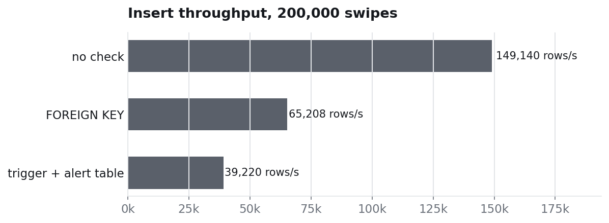

# 5. Root cause: the schema let the ghost in

Experiment: `benchmark/08_trigger_cost.py`. Demos on the lab database: `benchmark/design/foreign_key_attempt.sql`, `benchmark/design/trigger_alert.sql`.

The whole case rests on one line of the lab's schema:

```sql
-- No foreign key on badge_id: the readers store every card that is swiped, even unknown ones.
CREATE TABLE access_log ( ... badge_id VARCHAR(10) NOT NULL, ... );
```

Every other table points to `students` through a foreign key. `access_log` does not, so a card that belongs to nobody can walk into Room 204 and the database records it without complaint. Two ways to change that:

## Option 1: a foreign key

```sql
ALTER TABLE access_log
  ADD CONSTRAINT fk_access_badge FOREIGN KEY (badge_id) REFERENCES badges(badge_id);
-- ERROR 1452: Cannot add or update a child row: a foreign key constraint fails
```

It fails on the lab database because two orphan swipes already exist (`B-0000` in the gym on 16/09, and `B-9147`). More importantly, it is the wrong rule for this table: a badge reader that refuses to log unknown cards throws away exactly the evidence that solved the case.

## Option 2: keep every swipe, raise an alert

```sql
CREATE TABLE security_alerts (
  alert_id INT AUTO_INCREMENT PRIMARY KEY,
  access_id INT, badge_id VARCHAR(10), location VARCHAR(30),
  alert_at DATETIME, reason VARCHAR(100)
);

CREATE TRIGGER trg_unknown_badge
AFTER INSERT ON access_log
FOR EACH ROW
BEGIN
  IF NOT EXISTS (SELECT 1 FROM badges WHERE badge_id = NEW.badge_id) THEN
    INSERT INTO security_alerts (access_id, badge_id, location, alert_at, reason)
    VALUES (NEW.access_id, NEW.badge_id, NEW.location,
            TIMESTAMP(NEW.access_date, NEW.entry_time), 'UNKNOWN BADGE');
  END IF;
END;
```

Replaying the killer's swipe:

| badge_id | location | alert_at | reason |
|---|---|---|---|
| B-9147 | Room 204 | 2026-09-21 19:37:00 | UNKNOWN BADGE |

The alert exists at 19:37, eleven minutes before the ghost badge leaves the room.

## What each design costs

A badge log is written far more often than it is read, so the check has a price on every insert. `08_trigger_cost.py` inserts the same 200,000 valid swipes into three copies of the table:



| design | 200,000 inserts | throughput | unregistered swipe |
|---|---:|---:|---|
| no check (the lab's schema) | 1.34 s | 149,140 rows/s | accepted, nobody notices |
| `FOREIGN KEY` | 3.07 s | 65,208 rows/s | rejected (error 1452), evidence lost |
| trigger + alert table | 5.10 s | 39,220 rows/s | accepted and logged in `security_alerts` |

The trigger costs about 3.8× the plain insert time, because it runs a lookup (and possibly an insert) for every row. 39,000 swipes per second is still far more than any campus produces: 10 million swipes a year is about 0.3 per second on average.

## Takeaways

- The murder was solvable because the log kept the unknown card, and possible because nothing reacted to it.
- A constraint says "this must never happen"; for a security log, the right rule is "this must be noticed".
- Every check has a write cost. Here it is affordable by five orders of magnitude; on a hot table it would need measuring before shipping.
